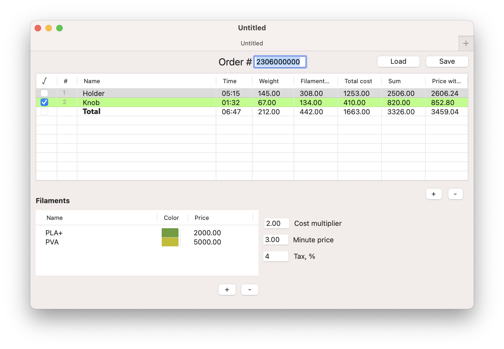
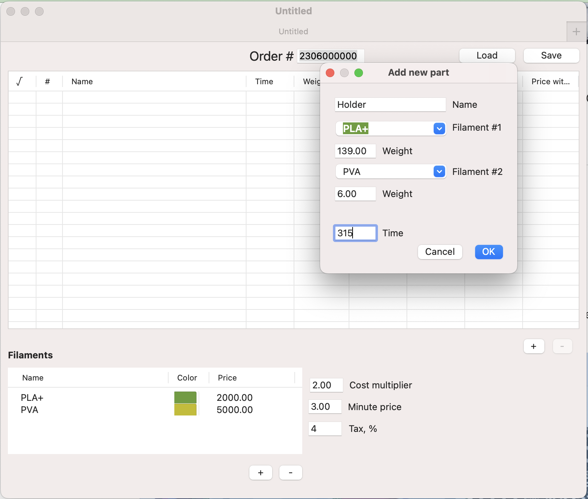

# Papey3D-Simple-ERP

A simple 3D-printing order managment software for MacOS thar allows to calculate the price based on printing time, used filaments, taxes etc.

It's in alpha version stage, which allows it to be used somewhat, but... that's it so far.
